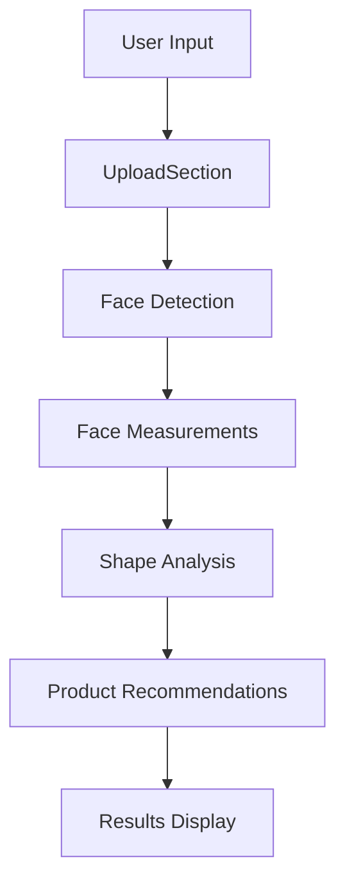

# Architecture

## Project Structure

```
face-shape-analyzer/
├── src/
│   ├── app/                 # Next.js app directory
│   │   ├── layout.tsx      # Root layout
│   │   ├── page.tsx        # Main page component
│   │   └── globals.css     # Global styles
│   ├── components/         # React components
│   │   ├── FaceShapeCard.tsx
│   │   └── UploadSection.tsx
│   ├── lib/               # Core functionality
│   │   ├── faceDetection.ts
│   │   ├── faceShapeMeasurements.ts
│   │   └── faceShapeDefinitions.ts
│   └── pages/             # Additional pages
│       └── _document.tsx  # Custom document
├── public/               # Static assets
├── docs/                # Documentation
└── next.config.js       # Next.js configuration
```

## Core Components

### 1. Main Application (src/app)
- **layout.tsx**: Defines the basic HTML structure
- **page.tsx**: Main application component
- **globals.css**: Global styles using Tailwind CSS

### 2. Components
- **FaceShapeCard.tsx**: Displays face shape information and recommendations
- **UploadSection.tsx**: Handles photo upload and camera functionality

### 3. Library Functions
- **faceDetection.ts**: TensorFlow.js integration and face detection
- **faceShapeMeasurements.ts**: Face measurement calculations
- **faceShapeDefinitions.ts**: Face shape definitions and product mappings

## Data Flow



## Key Technologies

### Frontend
- **Next.js**: React framework for production
- **React**: UI component library
- **Tailwind CSS**: Utility-first CSS framework

### AI/ML
- **TensorFlow.js**: Face detection and landmark identification
- **Face-landmarks-detection**: Facial feature detection

### Integration
- **Shopify Embed API**: Store integration
- **Image Processing**: Canvas API for photo manipulation

## Security Considerations

### CSP Configuration
```javascript
{
  "Content-Security-Policy": 
    "default-src 'self'; 
     img-src 'self' data: https://myhairmail.com https://cdn.shopify.com blob:; 
     script-src 'self' 'unsafe-eval' 'unsafe-inline';"
}
```

### Camera Access
- Secure HTTPS connection required
- Explicit user permission handling
- Stream cleanup on component unmount

## Performance Optimization

1. **Image Processing**
   - Client-side processing
   - Optimized image dimensions
   - Efficient canvas operations

2. **Model Loading**
   - Lazy loading of TensorFlow.js
   - Caching of face detection model
   - Progressive enhancement

3. **Resource Management**
   - Proper cleanup of camera streams
   - Memory leak prevention
   - Efficient state management

## Integration Points

### Shopify Integration
- Iframe embedding
- Product data synchronization
- Dynamic pricing updates

### External Services
- TensorFlow.js model loading
- Shopify CDN for images
- Analytics integration

## Error Handling

1. **Camera Errors**
   - Permission denials
   - Hardware unavailability
   - Stream initialization failures

2. **Face Detection Errors**
   - No face detected
   - Multiple faces
   - Poor image quality

3. **Network Errors**
   - Model loading failures
   - Image loading issues
   - API connectivity problems

## Deployment

### Production Deployment
- Vercel hosting
- Automatic deployments from main branch
- Environment variable management

### Development Setup
- Local development server
- Hot module replacement
- Development-specific configurations
